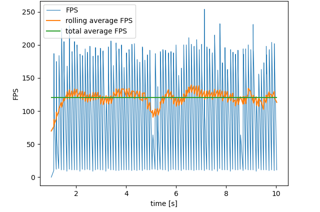
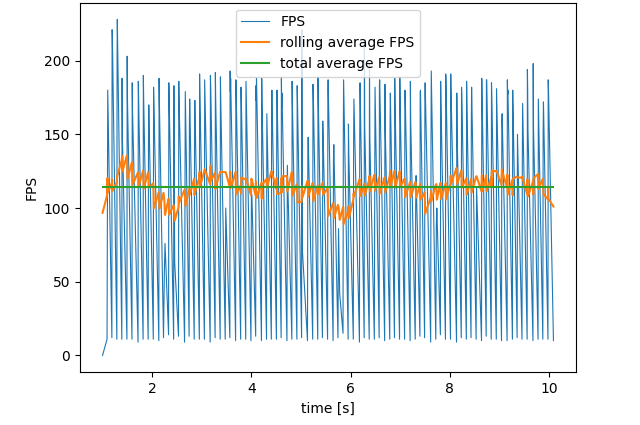
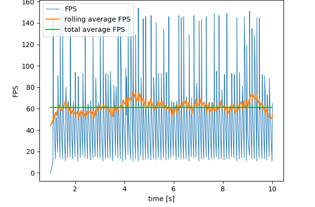
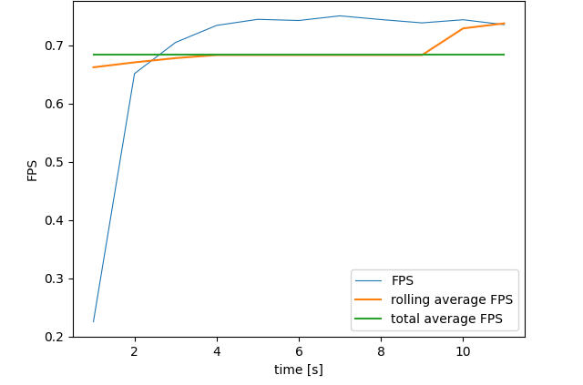

# Assignment 1: OpenCV setup and point operations
### author: David Pažout
------------

## assignment requirements

For testing, check and write down answers to the following questions:
- The processing time for one video frame or image?
- How does the processing time change when you add the bright spot detection?
- Is the processing time identical when you do not display the image?
- How does your for-loop implementation compare to the built-in function?
- Moving your hand in front of the camera, estimate the latency between image capture and display.
- Is the latency different when capturing from a mobile phone?

## results

For determining the processing time in FPS, I collected data for time-span of 10 seconds. I took a rolling and total average of the data. 

The processing time for one video frame without any additional processing is around 120 FPS. 

Adding the bright spot detection increases the processing time for the video frame to 114 FPS.

When not displaying the image (still doing the bright spot detection) the processing time increases to 60 FPS. 

Moving the processing to a double for loop decreases the FPS to 0.4 FPS.

I estimate the latency between image capture and display to be around 0.1 second but I have no process of validating my estimate.
The latency from a mobile phone is around 1 second.